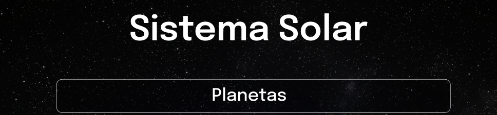

# Welcome to the Solar System project repository!

---

### Made by [Lucas Ximenes](https://www.linkedin.com/in/lucasdximenes/)

### [Github](https://github.com/lucasdximenes)

### [LinkedIn](https://www.linkedin.com/in/lucasdximenes/)

<details>
  <summary><strong>📝 Skills</strong></summary><br />

In this project, I learned to:

- Using JSX in React;

- Correctly use the `render()` method to render your components;

- Use `import` to bring components into different files;

- Create class components in React;

- Create multiple components from an array;

- Make use of `props` correctly;

- Make use of `PropTypes` to validate the `props of a component`.
</details>

---

### Preview


---

# guidelines

<details>
  <summary><strong>❗️❗️ Before you start running</strong></summary><br />

1. Clone the repository

- Use the command: `git clone git@github.com:lucasdximenes/solar-system-react.git`.
- Enter the repository folder you just cloned:
  - `cd solar-system-react`

2. Install dependencies

- `npm install`.

3. Run the init script

- `npm start`.
</details>

---

# Requirements met ✔️

## 1. Create a component called `Header` ✔️

<details>
  <summary>Create a component called <code>Header</code> inside the <code>src/components</code> folder. This component will render the main title of the page.</summary>

- It must contain a `header` tag and, inside it, an `h1` tag. The text of the `h1` tag should be "Solar System";
- Render the `Header` component inside the main `App` component.


</details>

<details>
  <summary><strong>What was checked</strong></summary><br />

- It was validated if the `<Header />` component is rendered;

- It was validated if the `<Header />` component contains a `header` tag;

- It was validated if the `<Header />` component contains an `h1` tag;

- It was validated that the `<Header />` component correctly renders the text "Solar System";

- It has been validated that the `<Header />` component is being rendered in the main `App` component.
</details>

---

## 2. Create a component called `SolarSystem` ✔️

<details>
  <summary>Create a component called <code>SolarSystem</code> inside the <code>src/components</code> folder.</summary>

- The `SolarSystem` component must have a `div` that encloses all its content and that has the `data-testid="solar-system"` attribute;

- Render the `SolarSystem` component below the `Header`, inside the main `App` component.
</details>

<details>
  <summary><strong>What was checked</strong></summary><br />

- It was validated if the `<SolarSystem />` component is rendered;

- It was validated if there is a `div` that has the `data-testid="solar-system"`;

- It has been validated that the `<SolarSystem />` component is being rendered in the main `App` component.
</details>

---

## 3. Create a component called `Title` ✔️

<details>
  <summary>Create a component called <code>Title</code> inside the <code>src/components</code> folder.</summary>

- The `Title` component must receive a `headline` prop;
- It should contain an `h2` tag, which should render the text received by the `headline` prop.
</details>

<details>
  <summary><strong>What was checked</strong></summary><br />

- It was validated if the `<Title />` component is rendered;

- It was validated if the `<Title />` component contains an `h2` tag;

- It was validated that the `<Title />` component renders the text passed by the `headline` prop inside an `h2` tag.
</details>

---

## 4. Render the `Title` component inside the `SolarSystem` component ✔️

<details>
  <summary>Render the <code>Title</code> component inside the <code>SolarSystem</code> component.</summary>

- The `Title` component must be rendered receiving the `headline` prop with the value "Planets".



</details>

<details>
  <summary><strong>What was checked</strong></summary><br />

- It has been validated that the text "Planets" is rendered using the `Title` component inside the `SolarSystem` component.
</details>

---

## 5. Create a component called `PlanetCard` ✔️

<details>
  <summary>Create a component called <code>PlanetCard</code> inside the <code>src/components</code> folder.</summary>

- The `PlanetCard` component must receive two props: one called `planetName` and another called `planetImage`;
- The `PlanetCard` component must have a `div` that encloses all its content and that has the `data-testid="planet-card"` attribute;
- The `PlanetCard` component should render the text received by the `planetName` prop. We suggest using tags from [Flow Content](https://developer.mozilla.org/pt-BR/docs/Web/Guide/HTML/Content_categories#conte%C3%BAdo_de_fluxo), such as `<p>`, which must contain the `data-testid="planet-name"` attribute;
- The `PlanetCard` component must render an image that has the `src` attribute with the value received by the `planetImage` prop;

- In addition to the `src` attribute, the rendered image must have the `alt` attribute with the text `Planet {planetName}`, where `{planetName}` is the value received by the `planetName` prop.
</details>

<details>
  <summary><strong>What was checked</strong></summary><br />

- It was validated if the `<PlanetCard />` component is rendered;

- It was validated if the `<PlanetCard />` component has a div with the `data-testid="planet-card"` attribute;

- It was validated if the text received by the `planetName` prop is rendered;

- It was validated if an image is rendered with the `src` attribute with the same value received by the `planetImage` prop;

- It was validated if, in addition to the `src` attribute, the rendered image has the `alt` attribute with the text `Planet {planetName}`, where `{planetName}` is the value received by the `planetName` prop.
</details>

---

## 6. Render a list with the planets of the Solar System ✔️

<details>
  <summary>Render a list of Solar System planets inside the <code>SolarSystem</code> component.</summary>

- Use the `PlanetCard` component to render each item in the list of planets;

- You will find the list with the names and images of each planet in the Solar System in the `src/data/planets.js` file;
- You must import the list into the `SolarSystem` component using the code:

```javascript
import planets from "../data/planets";
```

- The list of planets is an _array_ of objects in the following format:

```javascript
{
  name: "Planet name",
  image: "path-to-planet-image"
}
```

- For each planet in the list, you should render a `PlanetCard` component, passing the `name` attribute to the `planetName` prop and the `image` attribute to the `planetImage` prop.


</details>

<details>
  <summary><strong>What was checked</strong></summary><br />

- It will be checked if a `<PlanetCard />` component is rendered for each planet in the planet list;

- It will be checked if all the planets in the Solar System are being listed on the screen.
</details>

---

## 7. Create a component called `Missions`. ✔️

<details>
  <summary>Create a component called <code>Missions</code> inside the <code>src/components</code> folder.</summary>

- This component must have a `div` that encloses all its content and that has the `data-testid="missions"` attribute;

- Render the `Missions` component below the `SolarSystem`, inside the main `App` component.
</details>

<details>
<summary><strong>What was checked</strong></summary><br />

- It was validated if the `<Missions />` component is rendered;

- It was validated if there is a `div` that has the `data-testid="missions"`;

- It has been validated that the `<Missions />` component is being rendered in the main `App` component.
</details>

---

## 8. Render the `Title` component inside the `Missions` component. ✔️

<details>
  <summary>Render the <code>Title</code> component inside the <code>Missions</code> component.</summary>

- The `Title` component must be rendered receiving the `headline` prop with the value "Missions".


</details>
<details>
<summary><strong>What was checked</strong></summary><br />

- It has been validated that the text "Missions" is rendered using the `Title` component inside the `Missions` component.
</details>

---

## 9. Create a component called `MissionCard`. ✔️

<details>
  <summary>Create a component called <code>MissionCard</code> inside the <code>src/components</code> folder.</summary>

- The `MissionCard` component must receive four props:

  - `name`
  - `year`
  - `country`
  - `destination`

- The `MissionCard` component must have a `div` that encloses all its content and that has the `data-testid="mission-card"` attribute;

- The `MissionCard` component should render the text received by the `name` prop. We suggest using [Flow Content](https://developer.mozilla.org/pt-BR/docs/Web/Guide/HTML/Content_categories#conte%C3%BAdo_de_fluxo) tags, such as `<p>`, which must contain the `data-testid="mission-name"` attribute;

- The `MissionCard` component should render the text received by the `year` prop. We suggest using [Flow Content](https://developer.mozilla.org/pt-BR/docs/Web/Guide/HTML/Content_categories#conte%C3%BAdo_de_fluxo) tags, such as `<p>`, which must contain the `data-testid="mission-year"` attribute;

- The `MissionCard` component should render the text received by the `country` prop. We suggest using [Flow Content](https://developer.mozilla.org/pt-BR/docs/Web/Guide/HTML/Content_categories#conte%C3%BAdo_de_fluxo) tags, such as `<p>`, which must contain the `data-testid="mission-country"` attribute;

- The `MissionCard` component should render the text received by the `destination` prop. We suggest using [Flow Content](https://developer.mozilla.org/pt-BR/docs/Web/Guide/HTML/Content_categories#conte%C3%BAdo_de_fluxo) tags, such as `<p>`, that must contain the `data-testid="mission-destination"` attribute.
</details>

<details>
  <summary><strong>What was checked</strong></summary><br />

- It was validated if the `<MissionCard />` component is rendered;

- It was validated if the `<MissionCard />` component has a div with the `data-testid="mission-card"` attribute;

- It was validated if the text received by the `name` prop is rendered;

- It was validated if the text received by the `year` prop is rendered;

- It was validated if the text received by the `country` prop is rendered;

- It was validated whether the text received by the `destination` prop is rendered.
</details>

---

## 10. Render a list of space missions ✔️

<details>
  <summary>Render a list of space missions inside the <code>Missions</code> component.</summary>

- Use the `MissionCard` component to render each item in the mission list;

- You will find the list with the information of each space mission in the file `src/data/missions.js`;

- You must import the list into the `Missions` component using the code:

```javascript
import missions from "../data/missions";
```

- The space missions list is an _array_ of objects in the following format:

```javascript
{
  name: 'Mission name',
  year: 'Mission launch year',
  country: 'Country that launched the mission',
  destination: 'Mission Destination',
}
```

- For each space mission in the list, you must render a `MissionCard` component, passing each attribute to its respective prop.


</details>

<details>
  <summary><strong>What was checked</strong></summary><br />

- It will be checked if a `<MissionCard />` component is rendered for each space mission in the mission list;

- It will be checked if all space missions are being listed on the screen.
</details>

---
